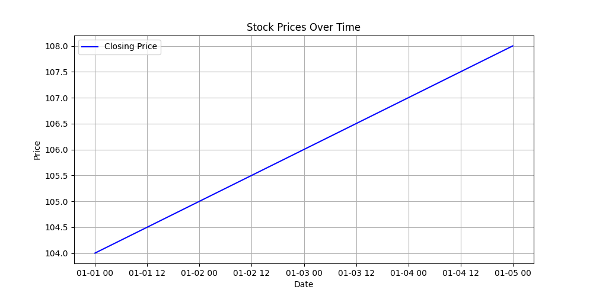

# 📊 Time Series Analysis for Stock Price Prediction  

## 📑 Project Overview  
This project demonstrates a complete time series analysis and forecasting of stock prices using Python and ARIMA models.  

## 🚀 Key Features  
- ✅ Data preparation and exploration with Pandas  
- ✅ Time series decomposition (Trend, Seasonality, Residual)  
- ✅ Stationarity testing using ADF Test  
- ✅ ARIMA model for 30-day forecasting  

## 🛠️ Tools & Libraries  
- Python, Pandas, Matplotlib, Statsmodels, ARIMA  

## 📂 Files Included  
- `time_series_analysis.py`: Complete Python script  
- `stock_prices.csv`: Public sample stock dataset  
- `price_chart.png`: Historical stock price plot  
- `Time_Series_Report.pdf`: Full project report  

## 📊 Example Forecast Plot  
  

## ⚠️ Disclaimer  
This project is for educational purposes and uses public sample data. Assistance from AI tools (ChatGPT) was used for learning support.  

## 💼 Author  
- **Developer:** Waseem Ibn Yousef CM  

## 📄 License  
Licensed under the [MIT License](LICENSE).  

---
